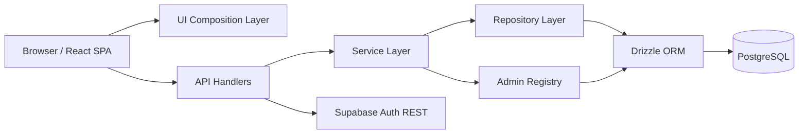
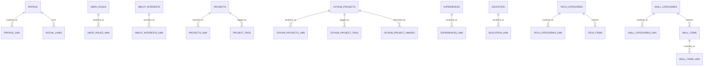

<p align="center">
  
</p>

<p align="center">
  <a href="https://vercel.com/">
    
  </a>
  <a href="https://github.com/Mik1810/Piccirilli_Michael_Portfolio">
    
  </a>
  <a href="./docs/API_CONTRACT.md">
    
  </a>
  <a href="./public/docs/Curriculum_Vitae_10_2025.pdf">
    
  </a>
</p>

<p align="center">
  
  
  
  
  
  
  
</p>

# Piccirilli Michael Portfolio

## Abstract

This repository implements a full-stack multilingual portfolio system whose purpose is not merely visual presentation, but canonical storage, controlled publication, and structured administration of professional and academic content.

The system is organized as a two-plane architecture:

- a public read plane optimized for deterministic content delivery;
- an admin control plane optimized for authenticated, schema-aware maintenance of the underlying relational dataset.

From an engineering perspective, the repository is best described as a domain-specific content management system specialized for a single actor rather than as a static personal website.

## Keywords

`portfolio CMS`, `TypeScript`, `React`, `Vite`, `Vercel Functions`, `Drizzle ORM`, `PostgreSQL`, `Supabase Auth`, `multilingual relational content`, `schema-driven admin`

## 1. Problem Framing

The core problem addressed by the project is the lifecycle management of multilingual portfolio content under the following constraints:

- content changes over time and must remain editable without code edits;
- the same entities must be rendered in more than one locale;
- presentation order is meaningful and must be persisted explicitly;
- the public interface should expose stable JSON contracts;
- the administrative surface should not depend on a browser-owned database SDK.

The consequence of these requirements is that the project cannot be modeled adequately as a collection of static markdown fragments or hard-coded React constants. It requires a normalized relational model, an API layer, an authenticated control plane, and a frontend capable of partial loading and graceful fallback.

## 2. System Objectives

The current repository is designed to satisfy five primary objectives:

1. store canonical portfolio content in PostgreSQL rather than in frontend source files;
2. expose public, locale-aware read APIs with deterministic DTOs;
3. provide an authenticated admin interface capable of generic CRUD across selected tables;
4. preserve relational invariants such as ordering, localization uniqueness, and parent-child integrity;
5. remain deployable on a lightweight serverless stack without introducing unnecessary infrastructure.

## 3. Current Repository State

At the current state of `main`, the repository satisfies the following properties:

- frontend and backend runtimes are fully TypeScript-based;
- the dominant backend pattern is `api -> service -> repository -> database`;
- public content repositories use Drizzle ORM against PostgreSQL;
- the admin data plane is schema-driven and also uses Drizzle-backed generic CRUD;
- admin authentication is implemented against Supabase Auth over explicit HTTP requests;
- no runtime dependency remains on `@supabase/supabase-js`;
- the public GitHub media path now treats `github_project_images` as canonical, while the legacy `github_projects.image_url` field has been removed from the runtime model;
- `npm run typecheck`, `npm run lint`, and `npm run build` pass.

## 4. System Architecture

### 4.1 Macro-architecture



### 4.2 Public Read Plane

The public plane is read-oriented and exposes portfolio content through narrow JSON endpoints:

- `/api/profile`
- `/api/about`
- `/api/projects`
- `/api/skills`
- `/api/experiences`

Each endpoint is intentionally thin:

- method enforcement;
- locale normalization;
- short-lived cache lookup;
- service invocation;
- consistent error response.

The repository layer reconstructs denormalized DTOs from normalized relational tables. This is especially visible in the projects domain, where a single API payload is assembled from:

- base project rows;
- localized text rows;
- tag rows;
- GitHub project rows;
- GitHub project images.

### 4.3 Admin Control Plane

The admin plane is a generic but schema-aware CRUD surface exposed through:

- `/api/admin/login`
- `/api/admin/logout`
- `/api/admin/session`
- `/api/admin/tables`
- `/api/admin/table`

Unlike a naive table editor, the admin plane is not "free-form dynamic SQL". It is constrained by:

- an explicit whitelist of allowed tables;
- a typed registry of table metadata;
- per-field normalization and validation rules;
- typed editor metadata used by the frontend form generator;
- Drizzle-backed repository operations selected through registry metadata.

This means the admin is generic at the UX level, but still bounded by a compile-time schema model.

## 5. Data Model

### 5.1 Modeling Strategy

The data model follows a normalized multilingual strategy:

- base tables represent structural entities;
- `*_i18n` tables represent locale-specific text;
- `order_index` encodes deterministic presentation order;
- `slug` is used when a stable semantic identifier is useful;
- uniqueness constraints preserve ordering and localization invariants.

### 5.2 Entity Families

- `profile` + `profile_i18n` + `social_links`
- `hero_roles` + `hero_roles_i18n`
- `about_interests` + `about_interests_i18n`
- `projects` + `projects_i18n` + `project_tags`
- `github_projects` + `github_projects_i18n` + `github_project_tags` + `github_project_images`
- `experiences` + `experiences_i18n`
- `education` + `education_i18n`
- `tech_categories` + `tech_categories_i18n` + `tech_items`
- `skill_categories` + `skill_categories_i18n` + `skill_items` + `skill_items_i18n`

### 5.3 ER Snapshot



### 5.4 Example Schema Fragment

From [schema.ts](/c:/Users/micha/Desktop/mik1810.github.io/lib/db/schema.ts):

```ts
export const githubProjectImages = pgTable(
  'github_project_images',
  {
    id: bigint('id', { mode: 'number' }).primaryKey().generatedByDefaultAsIdentity(),
    githubProjectId: bigint('github_project_id', { mode: 'number' }).notNull(),
    orderIndex: integer('order_index').notNull(),
    imageUrl: text('image_url').notNull(),
    altText: text('alt_text'),
  },
  (table) => [
    unique(
      'github_project_images_github_project_id_order_index_key'
    ).on(table.githubProjectId, table.orderIndex),
  ]
)
```

This fragment illustrates the general modeling philosophy:

- order is first-class;
- media is modeled as a child relation, not as a UI-only concern;
- uniqueness is encoded in schema rather than inferred in application code.

## 6. Public Content Delivery

### 6.1 Handler Contract

The public handler contract is intentionally minimal. A typical endpoint performs:

1. request method verification;
2. locale normalization;
3. cache lookup;
4. service invocation;
5. typed JSON serialization.

This separation keeps HTTP concerns distinct from domain composition.

### 6.2 Repository Composition

The repository layer is responsible for converting normalized rows into public DTOs. For example, [projectsRepository.ts](/c:/Users/micha/Desktop/mik1810.github.io/lib/db/repositories/projectsRepository.ts) reconstructs:

- human-readable localized fields from `*_i18n`;
- tag arrays from child rows;
- GitHub media arrays from `github_project_images`.

The frontend then consumes stable `projects` and `githubProjects` payloads without needing to understand the persistence model.

### 6.3 Resilience at the UI Boundary

The public UI now uses:

- section-level skeleton states;
- hero skeleton and phased reveal;
- partial readiness boundaries based on actual data availability rather than on raw loading flags alone.

The design goal is not only fast rendering, but monotonic rendering: the UI should move from placeholder to valid content without transient broken states such as missing names, empty role lines, or undefined sections.

## 7. Admin Control Plane in Detail

### 7.1 Authentication Model

Admin authentication is handled server-side via Supabase Auth REST. The server:

- receives credentials;
- forwards them to Supabase Auth;
- issues and verifies its own signed session cookie.

This preserves a server-owned auth boundary and avoids shipping a database/auth SDK into the admin browser runtime.

### 7.2 Schema-Driven Registry

The admin backend is driven by registry metadata declared under [lib/admin](/c:/Users/micha/Desktop/mik1810.github.io/lib/admin):

- group and subgroup membership;
- labels and descriptions;
- primary keys;
- default row shapes;
- field editor kinds;
- relation selectors;
- normalization and validation rules.

The registry therefore acts as an intermediate representation between the relational schema and the admin UI.

### 7.3 Drizzle-Backed Generic CRUD

Admin CRUD is implemented through:

- registry lookup;
- payload normalization;
- field-level validation;
- Drizzle `select / insert / update / delete` on the resolved table.

This is an important architectural distinction:

- the admin is generic at runtime;
- the admin is not schema-agnostic.

It is generic because the user can choose among multiple tables.
It is not schema-agnostic because every allowed operation is mediated by metadata derived from a compile-time schema.

### 7.4 Admin UI Synthesis

The React admin dashboard synthesizes its UI from backend metadata:

- grouped sidebar navigation;
- subgroup expansion logic;
- typed editors (`text`, `textarea`, `number`, `url`, `email`, `checkbox`, `color`, `select`);
- relation selects for foreign keys;
- bilingual create flow for `*_i18n` tables;
- structural descriptions for low-semantic tables such as `hero_roles` and `skill_items`;
- compact media/icon/link/color previews in the data grid.

The result is not a hardcoded per-entity backoffice, but a metadata-generated control plane over a bounded domain.

## 8. Technology Selection and Trade-offs

### 8.1 React + Vite Instead of a Full SSR Framework

Current rationale:

- the system is API-driven rather than route-loader-driven;
- operational simplicity is preferred over framework-integrated SSR;
- development latency is low;
- the deployment surface remains small.

Trade-off:

- SSR and route-level SEO primitives are not built in;
- if project detail pages or richer indexing become central, this decision may be revisited.

### 8.2 Drizzle Instead of a Heavier Generated ORM

Current rationale:

- relational intent remains close to the source code;
- schema definitions are explicit and reviewable;
- query behavior is easier to reason about during debugging and migration work;
- the system benefits from SQL-adjacent control more than from a generator-centric abstraction.

Trade-off:

- less codegen convenience than Prisma-like tools;
- more direct ownership of relational modeling.

### 8.3 Supabase for Auth Boundary, PostgreSQL for Canonical Data Access

The repository uses Supabase in a deliberately reduced role:

- authentication authority for admin login;
- managed PostgreSQL host.

It does not use Supabase as the runtime query abstraction. That role belongs to:

- Drizzle ORM;
- the `postgres` driver.

This separation keeps the data path explicit while preserving hosted auth and database operations.

### 8.4 Serverless Deployment Constraints

The production runtime is Vercel serverless, which introduces constraints on:

- connection fan-out;
- connection pooling behavior;
- statement lifetime;
- cold-start sensitivity.

For that reason the PostgreSQL client is configured conservatively for serverless operation, and the public repositories avoid unnecessary concurrent query bursts.

## 9. Runtime Environment and Reproducibility

### 9.1 Required Environment Variables

The repository expects [`.env.local`](/c:/Users/micha/Desktop/mik1810.github.io/.env.local) with:

```env
SUPABASE_URL=https://<project-ref>.supabase.co
SUPABASE_SECRET_KEY=<service-role-or-secret>
DATABASE_URL=postgresql://<user>:<password>@<host>:6543/postgres?sslmode=require
```

Semantics:

- `SUPABASE_URL`: HTTP endpoint for auth REST;
- `SUPABASE_SECRET_KEY`: admin auth secret;
- `DATABASE_URL`: PostgreSQL DSN used by Drizzle, the `postgres` driver, and SQL tooling.

For serverless production, the DSN should target the Supabase IPv4 transaction pooler.

### 9.2 Commands

Development:

```bash
npm run dev
npm run dev:api
npm run dev:fast
npm run dev:vercel
```

Quality gates:

```bash
npm run typecheck
npm run lint
npm run build
npm run format
```

Database tooling:

```bash
npm run db:generate
npm run db:migrate
npm run db:studio
```

### 9.3 Database Dumps

The repository includes:

- [dump.sql](/c:/Users/micha/Desktop/mik1810.github.io/dump/dump.sql)
- [dump_schema.sql](/c:/Users/micha/Desktop/mik1810.github.io/dump/dump_schema.sql)

These dumps serve two technical purposes:

- schema verification against the live database;
- historical alignment between Drizzle schema and actual relational state.

## 10. Observability and Operational Safeguards

### 10.1 Error Handling

The HTTP layer uses shared utilities for:

- method guards;
- consistent JSON errors;
- typed HTTP exceptions;
- contextual endpoint logging.

Core files:

- [apiUtils.ts](/c:/Users/micha/Desktop/mik1810.github.io/lib/http/apiUtils.ts)
- [logger.ts](/c:/Users/micha/Desktop/mik1810.github.io/lib/logger.ts)

### 10.2 Cache and Rate Limit

The current runtime uses:

- process-local memory cache for public read endpoints;
- process-local rate limiting for sensitive admin operations.

This is adequate for current scale, but not yet distributed.

### 10.3 Verification Status

The current codebase is continuously checked with:

- `npm run typecheck`
- `npm run lint`
- `npm run build`

These are the minimum reproducibility gates expected before deployment.

## 11. Limitations

The current repository is structurally strong, but not final. Known current limits include:

- cache and rate limiting are process-local rather than distributed;
- no formal runtime schema validation library such as Zod is integrated yet;
- no public project-detail route exists yet;
- some admin UX remains metadata-rich but still generic rather than task-specific;
- the GitHub projects media model is clean at runtime, but some historical asset placeholders may still deserve content-level cleanup.

These are explicit engineering boundaries, not hidden defects.

## 12. Internal References

- roadmap: [IMPROVEMENTS.md](/c:/Users/micha/Desktop/mik1810.github.io/IMPROVEMENTS.md)
- API contract: [API_CONTRACT.md](/c:/Users/micha/Desktop/mik1810.github.io/docs/API_CONTRACT.md)
- session log: [SESSION.md](/c:/Users/micha/Desktop/mik1810.github.io/SESSION.md)
- schema dump: [dump_schema.sql](/c:/Users/micha/Desktop/mik1810.github.io/dump/dump_schema.sql)
